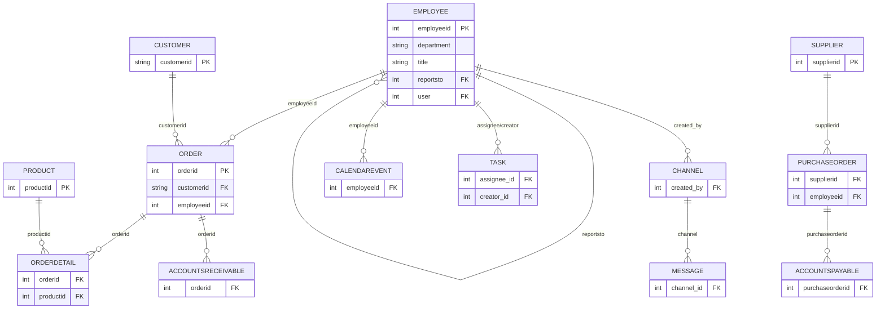

# SSAFY International ERP

Northwind 데이터셋을 기반으로 한 가상의 국제 무역회사 "SSAFY International"을 위한 통합 ERP 시스템입니다. 영업·구매·재무·인사·물류·재고 업무를 하나의 시스템에서 관리하고, AI를 통해 업무 추천과 수요예측을 보조합니다.

- **Backend**: Django 5 / Django REST Framework / SimpleJWT / dj-rest-auth / Django Channels(WebSocket)
- **Frontend**: Vue 3 (Composition API) / Pinia / Vue Router / Chart.js / Bootstrap 5
- **AI**: GMS(SSAFY API 게이트웨이, OpenAI 호환) — `gpt-5.4-nano`
- **DB**: SQLite (개발), Django ORM
- **데이터**: Northwind 기반 증강 데이터셋(`SSAFY_International_augmented_v8.json`, 약 3만 건)

---

## A. 팀원 정보 및 업무 분담

| 이름 | 담당 영역 |
|---|---|
| **김동현** | 프로젝트 초기 셋업(Django/Vue 스캐폴딩, 패키지 구성), ERD 설계 및 초기 데이터셋 업로드, **인사(employees)** 도메인(직원/조직도/근태), **사내 메신저(messages)** 도메인(Django Channels 기반 실시간 채팅) 백엔드+프론트 |
| **이민석** | **영업/구매/재무/재고/물류/급여** 도메인 백엔드 전반, **Works**(캘린더·업무관리·AI 워크플로우 추천) 전체, **AI 수요예측(analytics)**, 영업/경영/성과분석 대시보드, 데이터 정합성 버그 다수 발견·수정, README 작성 |

> 두 사람 모두 백엔드 전반(특히 works/finance/procurement/messages 앱)에 걸쳐 서로의 기능을 보완하며 커밋했고, 위 표는 각자가 **주로** 설계/구현을 주도한 영역을 기준으로 정리한 것입니다.

---

## B. 목표 서비스 및 실제 구현 정도

### 목표
하나의 가상 무역회사를 가정하고, 영업(고객·주문)부터 구매(발주·입고), 생산(BOM), 재무(예산·매출채권/매입채무), 인사(근태·급여), 물류(배차)까지 ERP의 전 영역을 다루면서, **AI가 매출을 예측하고 그날 해야 할 업무 우선순위를 추천해주는** 의사결정 보조 기능을 추가하는 것을 목표로 했습니다.

### 실제 구현 정도

| 영역 | 구현 내용 |
|---|---|
| 인사 | 직원 CRUD, 조직도, 근태(출퇴근), 연차 신청/승인, 역할 기반(직급→레벨 1~5) 접근 제어 |
| 급여 | 월급/보너스/연말정산/퇴직금 산출 및 조회 |
| 영업 | 고객·주문 관리, 영업 대시보드(실매출/지역별/카테고리별), 영업성과 분석 |
| 구매/생산 | 발주 관리, 입고(검수) 관리, BOM(자재명세서) |
| 재무 | 예산/경비, 매출채권·매입채무, 경영 대시보드(영업이익·예산집행률 등) |
| 재고 | 재고 실사 계획/항목 |
| 물류 | 배차 관리 |
| 사내 메신저 | 채널/DM, 실시간 메시지(WebSocket), 읽음 처리 |
| Works | 캘린더, 업무(Task) 관리, **AI 워크플로우 추천** — 캘린더/업무/AI 추천 3개 화면이 같은 데이터로 연동 |
| AI 수요예측 | 실주문 데이터 기반 매출 추이 예측, 백테스트 정확도, 제품별 수요예측, 계절성 분석 |

### 한계 / 미구현

- 결제, 이메일/SMS 알림 같은 외부 연동은 범위에서 제외했습니다.
- 모바일 반응형 레이아웃은 별도로 대응하지 않았습니다.
- 데이터셋이  증강 도구로 주기적으로 갱신되는 구조라, 일부 시점에 마이그레이션과 실제 DB 스키마가 어긋나는 문제가 반복적으로 발생했습니다(자세한 내용은 H 항목 참고).

---

## C. 데이터베이스 모델링 (ERD)

`ERP_backend`의 10개 앱(`employees`, `payroll`, `ssafy_international`, `finance`, `procurement`, `inventory`, `logistics`, `messages`, `works`, `analytics`) 기준 41개 테이블로 구성되어 있습니다. 전체 ERD는 [`ERD.md`](./ERD.md) / [`ERD.svg`](./ERD.svg)에 별도로 정리해두었고, 핵심 구조는 다음과 같습니다.

> `EMPLOYEE`가 거의 모든 도메인의 허브 역할을 합니다(주문 담당자, 발주 담당자, 캘린더/업무 소유자, 메신저 발신자 등). 전체 41개 테이블의 상세 필드와 관계는 [`ERD.svg`]에서 확인할 수 있습니다.

---

## D. 추천 알고리즘에 대한 기술적 설명

### D-1. AI 수요예측 (경영 → AI 예측)

실제 주문 데이터(`Order` + `Orderdetail`)만 사용하고, 부족한 부분은 통계적으로 명확히 처리합니다.

1. **집계**: `Orderdetail.unitprice × quantity × (1 - discount)`로 주문별 실매출을 계산하고, `Order.orderdate` 기준 연-월로 묶습니다.
2. **활동 구간 선별**: 한 달에 일정 건수(임계값) 미만으로 주문이 발생한 "희소 구간"은 추세 계산에서 제외하고, 가장 최근의 **연속된 활동 구간**만 학습에 사용합니다. 데이터가 특정 시기에 몰려 있고 중간에 공백이 있는 실데이터 특성을 반영한 처리입니다.
3. **추세 산출**: 그 구간에 단순 선형회귀(least squares)를 적용해 기울기·절편을 구하고, 다음 1~3개월 매출을 예측합니다. 신뢰구간은 잔차의 RMSE를 이용해 `예측값 ± 1.96 × RMSE`(근사 95%)로 계산합니다.
4. **정확도(백테스트)**: 학습 구간을 75%(train) / 25%(test)로 나눠, train으로 학습한 회귀선이 test 구간을 얼마나 잘 맞추는지 MAPE(평균 절대 백분율 오차) 기준으로 측정하고 `100 - MAPE`를 정확도로 표시합니다.
5. **제품별 예측**: 주문 이력이 5건 이상인 품목만 대상으로, 최근 6건을 절반으로 나눠 전반기/후반기 평균 판매량을 비교해 성장률과 다음달 예측치를 추정하고, 현재고를 평균 판매량으로 나눈 "공급 가능 월수"로 과잉/부족 재고를 판정합니다.
6. **AI 인사이트**: 위 통계 요약(앵커 월, 최근 추이, 예측치, 정확도, 과잉재고 품목 수)을 GMS(`gpt-5.4-nano`)에 전달해 자연어 해설을 생성합니다 — 수치 계산은 전부 서버에서 끝낸 뒤, AI는 "해설"만 담당하는 구조입니다.

> 실험: 실제 데이터가 2024년·2026년에만 몰려있고 2025년 대부분이 공백이라 백테스트 정확도가 34.5%까지 떨어진 적이 있었는데, 원인을 분석해보니 연속 활동 구간이 7개월로 짧아져 단 한 달의 이상치가 정확도 전체를 흔드는 구조였습니다. 시드 데이터의 월별 분포(점진적 우상향 + 계절성)를 재구성해 같은 로직으로 다시 돌려보니 83.2%까지 올라가는 것을 확인했고, 이를 통해 "예측 모델의 한계"와 "학습 데이터 분포의 영향"을 분리해서 진단하는 경험을 했습니다.

### D-2. AI 워크플로우 추천 (Works → 워크플로우)

1. **데이터 수집**: 로그인한 직원 기준으로, 해당 날짜가 속한 **그 주(일~토)** 안에 마감인 `Task`, 그날 `CalendarEvent`, 배송 요청일이 그날인 `Order`, 입고 예정일이 그날인 `PurchaseOrder`를 모두 모아 `source_type:source_id` 형태로 정규화합니다.
2. **우선순위 프롬프트**: "기준일은 X이고 이 주는 Y~Z이다. 각 항목의 deadline을 기준으로, 오늘이거나 지난 항목은 high, 이번 주 후반은 deadline이 가까운 순으로 medium, 완료된 항목은 마지막"이라는 규칙을 명시한 프롬프트를 만들어 GMS에 전달하고, 우선순위가 매겨진 JSON 배열로 응답을 받습니다.
3. **캐싱과 무효화**: 응답은 직원·날짜별로 60초간 캐시하되, Task/CalendarEvent가 생성·수정·삭제되면 **그 날짜가 속한 주 전체**의 캐시를 무효화합니다. 추천이 "그 주간 업무"를 함께 보는 구조라, 어떤 날짜를 보고 있었든 새 업무가 생기면 캐시가 즉시 갱신되어야 하기 때문입니다.

---

## E. 핵심 기능 설명

### 1. 사내 실시간 메신저
Django Channels(WebSocket) 기반으로 채널/DM 메시지를 실시간으로 주고받고, 읽음 처리(`MessageRead`)까지 추적합니다. JWT 토큰으로 WebSocket 연결을 인증하는 별도 인증 모듈(`messages/token_auth.py`)을 구성했습니다.

### 2. Works — 캘린더 · 업무관리 · AI 워크플로우 연동
캘린더에 등록한 일정과 업무관리(Task)의 마감일이 같은 화면에 자동으로 표시되고, AI 워크플로우 추천 화면은 그 데이터를 다시 모아 우선순위를 매겨 보여줍니다. 세 화면이 같은 백엔드 데이터를 공유하기 때문에, 업무 상태(상태값 영어/한글 표기 통일, 사원별 데이터 격리 등)를 끝까지 일관되게 맞추는 데 신경을 많이 썼습니다.

### 3. AI 기반 수요예측 / 경영·영업 대시보드
실제 주문·재무·구매 데이터를 가공해 매출 추이, 영업이익(매출-매입원가-경비), 예산 집행률, 납기 준수율, 품질 합격률 등을 전부 **실데이터 기반**으로 계산합니다. 개발 과정에서 freight(배송비)를 매출로 잘못 합산하던 버그, 매출채권/매입채무 "잔액"에 이미 완납된 건까지 합산하던 버그, 존재하지 않는 "채널"·"생산 가동률" 데이터를 하드코딩해두었던 부분 등을 다수 발견해 실데이터 기반 지표로 교체했습니다.

### 4. 사원 레벨(LV) 기반 접근 권한 제어
`employees/views.py`의 `TITLE_LEVEL` 딕셔너리로 직급 문자열(대표이사·Vice President·Sales Manager·Inside Sales Coordinator·Sales Representative)을 레벨 1~5로 매핑합니다. DB에 별도 권한 컬럼을 두지 않고 **코드에서 직급 → 레벨을 동적으로 결정**하는 방식입니다. 프론트(`router/index.js`)에서는 라우트마다 `meta.requiresLevel`을 선언해두고 `router.beforeEach`에서 로그인한 사원의 레벨과 비교해 미달 시 `/access-denied`로 보냅니다(예: 경영성과·예산관리는 Lv4 이상). `meta.requiresHRorLevel5`처럼 "레벨 5 이상 **또는** 특정 부서"같은 복합 조건도 지원해 급여 등 민감 정보 화면에 적용했습니다.

### 5. 도메인 앱별 일관된 REST CRUD 설계
구매(procurement)·물류(logistics)·영업(ssafy_international) 등 도메인 앱마다 **`_list`(GET 목록조회 + POST 생성)**와 **`_detail`(GET 단건조회 + PUT/PATCH 수정 + DELETE 삭제)** 두 종류의 함수형 뷰(`@api_view`)로 패턴을 통일했습니다. PurchaseOrder/GoodsReceipt(구매), Dispatch/Vehicle(물류), Order/Customer(영업) 모두 같은 한 쌍의 구조를 그대로 따르기 때문에 새 리소스를 추가할 때 동일한 패턴을 재사용할 수 있습니다. 직렬화도 `ModelSerializer` + `source=`를 활용해 화면에서 바로 쓸 이름(예: `category_name`, `supplier_name`)을 서버에서 미리 JOIN해 내려주는 방식으로 표준화했습니다.

---

## F. 생성형 AI를 활용한 부분

### 서비스 기능 자체
- **AI 워크플로우 추천**: 직원별 업무/일정/주문/발주를 모아 GMS(`gpt-5.4-nano`)로 우선순위를 추천 (D-2)
- **AI 수요예측 인사이트**: 통계 모델이 산출한 예측치를 자연어로 해설 (D-1)

### 개발 과정
- **Claude Code(Anthropic)**를 페어 프로그래밍 도구로 활용해 백엔드/프론트 기능 구현, 버그 진단(예: `USE_TZ=False` 환경에서 `timezone.localdate()`가 깨지는 문제, 사원별 데이터 격리 누락 등), 대시보드 실데이터 검증, README 작성까지 전체 개발 사이클에 사용했습니다.
- AI 수요예측의 백테스트 정확도를 개선하는 과정에서, 시드 데이터셋의 월별 매출 분포를 재구성하는 실험(점진적 우상향 + 계절성 패턴 설계 → 정확도 34.5%→83.2% 개선 확인)에도 생성형 AI를 활용했습니다.

---

## G. 서비스 URL

> https://glistening-twilight-831e13.netlify.app

---

## H. 기타

### 트러블슈팅 노트
- **`USE_TZ=False` + `timezone.localdate()` 충돌**: Django 설정에서 타임존을 비활성화한 상태로 `django.utils.timezone`의 timezone-aware 헬퍼를 쓰면 `ValueError: localtime() cannot be applied to a naive datetime`가 발생합니다. 이 프로젝트 전반에서 같은 패턴의 버그가 여러 번(직원/근태, Works 캐시 무효화 로직 등) 재발했는데, 결국 `datetime.date.today()`처럼 타임존 비의존적인 호출로 통일해 해결했습니다.
- **데이터 증강 도구와 마이그레이션의 어긋남**: 데이터셋이 외부 증강 스크립트로 주기적으로 재생성되는 구조라, 마이그레이션 파일이 리셋되어 있는데 DB 데이터는 남아있는 상황이 반복됐습니다. 매번 실제 마이그레이션 디렉터리 상태를 확인하고 `dependencies`를 맞춰주는 방식으로 대응했습니다.
- **상태값 표기 불일치**: `Task.status`에 `choices` 제약이 없어서, 화면별로 영어(`TODO`/`DONE`)와 한글(`완료`/`대기`) 문자열이 혼용 저장된 적이 있었습니다. 전 화면을 영어 저장 + 한글 표시로 통일해 해결했습니다.

### 기술 스택 상세
- **Backend**: Django 5.2 · DRF 3.17 · SimpleJWT · dj-rest-auth(+allauth) · Django Channels 4.3(+channels-redis) · OpenAI SDK(GMS 게이트웨이 연동) · SQLite
- **Frontend**: Vue 3.5(Composition API) · Pinia 3 · Vue Router · Chart.js 4 / vue-chartjs · Bootstrap 5 · Vite

---

## 팀원별 개발 회고

### 김동현

**학습한 내용**
- Django 프로젝트를 처음부터 구성하면서 앱 단위 분리(employees, ssafy_international, messages 등) 구조와 `settings.py`/`urls.py` 설정 방식을 익혔습니다.
- Northwind 기반 데이터셋을 우리 서비스에 맞게 변형해 초기 ERD를 설계하고, `dumpdata`/`loaddata`로 대용량 fixture를 다루는 방법을 학습했습니다.
- Django Channels로 WebSocket 기반 실시간 메신저를 구현하면서, REST API와는 다른 비동기 컨슈머(`consumers.py`) 구조와 JWT 기반 WebSocket 인증 방식을 새로 익혔습니다.

**어려웠던 부분**
- 자기참조 FK(`reportsto`)를 가진 `Employee` 모델 위에 조직도·메신저·근태 등 여러 도메인이 동시에 의존하다 보니, 모델을 수정할 때마다 영향 범위를 파악하는 데 시간이 걸렸습니다.
- WebSocket 인증을 일반 DRF의 토큰 인증과 별도로 다시 구성해야 했던 부분이 까다로웠습니다(HTTP 헤더 기반 인증을 WebSocket 핸드셰이크 단계로 옮기는 과정).
- `USE_TZ=False`로 설정된 프로젝트에서 타임존 인지(timezone-aware) 함수를 섞어 쓰면 깨진다는 사실을 몰랐던 채로 같은 종류의 버그(`timezone.localdate()` 관련)를 세션 내에서 세 번이나 재발시켰습니다. 직접 겪은 패턴을 메모해두지 않으면 같은 실수를 반복한다는 걸 깨달았습니다.

**느낀 점**
- 초기 데이터 모델링이 이후 모든 기능 개발의 전제가 된다는 것을 체감했고, 협업 시 모델 변경을 미리 공유하는 것이 중요하다고 느꼈습니다.
- 데이터 기반 기능(AI 예측, 대시보드 KPI)을 만들 때는 "실데이터인가"를 계속 의심하고 검증하는 습관이 결과물의 신뢰도를 크게 좌우한다는 것을 배웠습니다.
---

### 이민석

**학습한 내용**
- DRF 함수 기반 뷰(`@api_view`)로 REST API를 설계하면서, 직급 문자열을 코드에서 레벨로 매핑하는 식의 "DB에 저장하지 않는 권한 모델" 설계 방식을 익혔습니다.
- 단순 선형회귀·백테스트(MAPE)처럼 통계 기법을 실제 비즈니스 데이터(주문 매출)에 적용해보면서, "모델이 안 맞는다"와 "데이터가 부족/편향되어 있다"를 구분해서 진단하는 경험을 했습니다. 실제로 AI 수요예측 정확도가 낮게 나온 원인이 모델보다 학습 데이터의 분포(특정 시기에만 데이터가 몰려있는 문제)에 있다는 것을 백테스트 결과를 직접 까보며 확인했습니다.
- 캐시 무효화 전략(언제, 어떤 키를, 어떻게 지워야 "최신성"이 보장되는지)을 AI 워크플로우 추천 기능에 적용하면서, 단순히 TTL만 짧게 주는 것보다 "데이터가 바뀌는 시점에 정확히 무효화"하는 설계가 왜 필요한지 체감했습니다.

**어려웠던 부분**
- 화면이 늘어날수록 같은 데이터(`Task.status` 등)를 화면마다 다른 표기(영어/한글)로 저장하는 불일치가 누적되어 있었고, 이걸 추적해서 한 번에 통일하는 데 생각보다 손이 많이 갔습니다.
- 대시보드 숫자들이 "그럴듯하게 보이지만 실제로는 틀린" 경우(freight를 매출로 합산, 완납된 채권까지 잔액에 포함 등)가 많아서, 화면에 숫자가 떠 있다고 끝난 게 아니라 그 숫자가 실제로 무엇을 의미하는지 모델 필드 단위까지 검증해야 한다는 걸 배웠습니다.
- AI 예측 정확도를 올리기 위해 시드 데이터의 날짜를 일부 재배치하는 실험을 하면서, 작은 패치(빈 달 8개만 채움)가 오히려 정확도를 0%까지 떨어뜨리는 경험을 했습니다. "서로 다른 국면(boom-bust-boom)을 억지로 하나의 직선에 맞추면 더 나빠진다"는 것을 직접 겪고서야 이해했습니다.

**느낀 점**
- ERP처럼 도메인이 많은 시스템에서는 기능을 추가하는 것보다 "이미 있는 화면들이 같은 데이터를 같은 방식으로 가리키게 만드는 것"이 훨씬 어렵고 중요한 작업이라는 걸 느꼈습니다.

